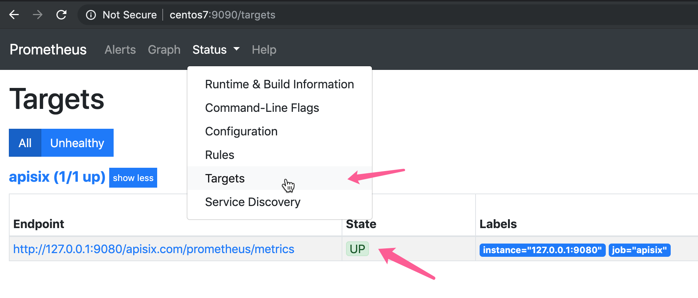
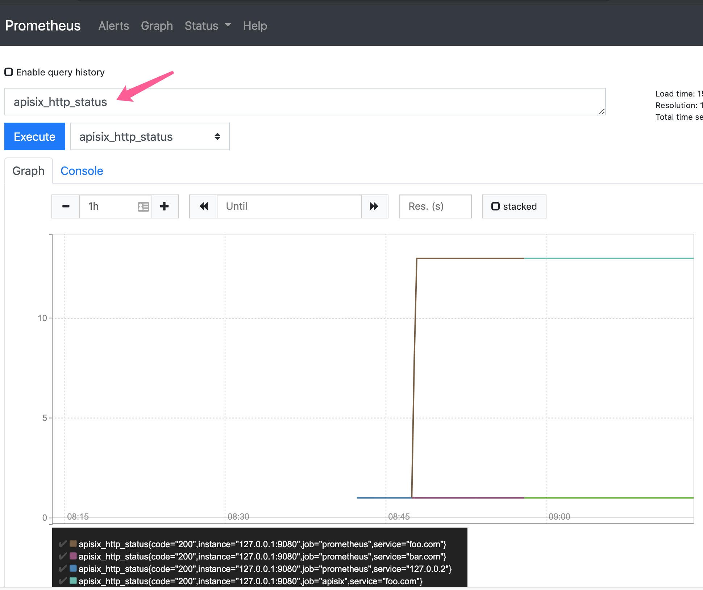

<!--
#
# Licensed to the Apache Software Foundation (ASF) under one or more
# contributor license agreements.  See the NOTICE file distributed with
# this work for additional information regarding copyright ownership.
# The ASF licenses this file to You under the Apache License, Version 2.0
# (the "License"); you may not use this file except in compliance with
# the License.  You may obtain a copy of the License at
#
#     http://www.apache.org/licenses/LICENSE-2.0
#
# Unless required by applicable law or agreed to in writing, software
# distributed under the License is distributed on an "AS IS" BASIS,
# WITHOUT WARRANTIES OR CONDITIONS OF ANY KIND, either express or implied.
# See the License for the specific language governing permissions and
# limitations under the License.
#
-->

此插件是提供符合 prometheus 数据格式的监控指标数据。

## 属性

| 名称         | 类型   | 必选项 | 默认值   | 有效值       | 描述                                                  |
| ------------ | ------ | ------ | -------- | ------------ | ----------------------------------------------------- |
| route_type   | string | 可选    | "id"     | ["id", "name"] | Prometheus 指标中，路由和服务的表现形式。          |

## 接口

插件会增加 `/apisix/prometheus/metrics` 这个接口。

指标默认会通过独立的服务地址暴露。
默认情况下，这个地址是 `127.0.0.1:9091`。你可以在 `conf/config.yaml` 里面修改它，比如：

```
plugin_attr:
  prometheus:
    export_addr:
      ip: ${{INTRANET_IP}}
      port: 9092
```

假设环境变量 `INTRANET_IP` 是 `172.1.1.1`，现在 APISIX 会在 `172.1.1.1:9092` 上暴露指标。

**在 2.6 版本之前，指标会直接暴露到数据面的端口上，你可能需要通过 [interceptors](../plugin-interceptors.md)
来保护它。**

如果你依然想要这样的行为，你可以这么配置：

```
plugin_attr:
  prometheus:
    enable_export_server: false
```

## 如何开启插件

`prometheus` 插件可以使用空 {} 开启。一个可选的选项为 `route_type`，其默认值为 `id`。
当设置为 `name` 时，Prometheus指标中路由和服务的表现形式会从其 id 改为名称。
注意，多个路由/服务可以设置为相同的名称，因此注意规范命名，否则容易引起误解。

例子如下:

```shell
curl http://127.0.0.1:9080/apisix/admin/routes/1 -H 'X-API-KEY: edd1c9f034335f136f87ad84b625c8f1' -X PUT -d '
{
    "uri": "/hello",
    "plugins": {
        "prometheus":{}
    },
    "upstream": {
        "type": "roundrobin",
        "nodes": {
            "127.0.0.1:80": 1
        }
    }
}'
```

你可以使用浏览器打开 dashboard：`http://127.0.0.1:9080/apisix/dashboard/`，通过 web 界面来完成上面的操作，先增加一个 route：


然后在 route 页面中添加 prometheus 插件：


## 如何提取指标数据

我们可以从指定的 url 中提取指标数据 `/apisix/prometheus/metrics`:

```
curl -i http://127.0.0.1:9091/apisix/prometheus/metrics
```

把该 uri 地址配置到 prometheus 中去,就会自动完成指标数据提取.

例子如下:

```yaml
scrape_configs:
  - job_name: "apisix"
    metrics_path: "/apisix/prometheus/metrics"
    static_configs:
      - targets: ["127.0.0.1:9091"]
```

我们也可以在 prometheus 控制台中去检查状态:





## 如何修改暴露指标的 uri

我们可以在 `conf/config.yaml` 的 `plugin_attr` 修改默认的 uri

| 名称       | 类型   | 默认值                       | 描述           |
| ---------- | ------ | ---------------------------- | -------------- |
| export_uri | string | "/apisix/prometheus/metrics" | 暴露指标的 uri |

配置示例:

```yaml
plugin_attr:
  prometheus:
    export_uri: /apisix/metrics
```

### Grafana 面板

插件导出的指标可以在 Grafana 进行图形化绘制显示。

下载 [Grafana dashboard 元数据](../../../assets/other/json/apisix-grafana-dashboard.json) 并导入到 Grafana 中。

你可以到 [Grafana 官方](https://grafana.com/grafana/dashboards/11719) 下载 `Grafana` 元数据.


### 可有的指标

* `Status codes`: upstream 服务返回的 HTTP 状态码，可以统计到每个服务或所有服务的响应状态码的次数总和。具有的维度：

    | 名称          |    描述             |
    | -------------| --------------------|
    | code         | upstream 服务返回的 HTTP 状态码。 |
    | route        | 请求匹配的 route 的 `route_id`，未匹配，则默认为空字符串。 |
    | matched_uri  | 请求匹配的 route 的 `uri`，未匹配，则默认为空字符串。 |
    | matched_host | 请求匹配的 route 的 `host`，未匹配，则默认为空字符串。 |
    | service      | 与请求匹配的 route 的 `service_id`。当路由缺少 service_id 时，则默认为 `$host`。 |
    | consumer     | 与请求匹配的 consumer 的 `consumer_name`。未匹配，则默认为空字符串。 |
    | node         | 命中的 upstream 节点 `ip`。|

* `Bandwidth`: 流经 APISIX 的总带宽(可分出口带宽和入口带宽)，可以统计到每个服务的带宽总和。具有的维度：

    | 名称          |    描述        |
    | -------------| ------------- |
    | type         | 带宽的类型(`ingress` 或 `egress`)。 |
    | route        | 请求匹配的 route 的 `route_id`，未匹配，则默认为空字符串。 |
    | service      | 与请求匹配的 route 的 `service_id`。当路由缺少 service_id 时，则默认为 `$host`。 |
    | consumer     | 与请求匹配的 consumer 的 `consumer_name`。未匹配，则默认为空字符串。 |
    | node         | 命中的 upstream 节点 `ip`。 |

* `etcd reachability`: APISIX 连接 etcd 的可用性，用 0 和 1 来表示，`1` 表示可用，`0` 表示不可用。
* `Connections`: 各种的 Nginx 连接指标，如 active（正处理的活动连接数），reading（nginx 读取到客户端的 Header 信息数），writing（nginx 返回给客户端的 Header 信息数），已建立的连接数。
* `Batch process entries`: 批处理未发送数据计数器，当你使用了批处理发送插件，比如：sys logger, http logger, sls logger, tcp logger, udp logger and zipkin, 那么你将会在此指标中看到批处理当前尚未发送的数据的数量。
* `Latency`: 每个服务的请求用时和 APISIX 处理耗时的直方图。具有的维度：

    | 名称          |    描述        |
    | -------------| ------------- |
    | type         | 该值可以为`apisix`, `upstream` 和 `request`，分别表示耗时的来源为 APISIX、上游及其总和。 |
    | service      | 与请求匹配的 route 的 `service_id`。当路由缺少 service_id 时，则默认为 `$host`。 |
    | consumer     | 与请求匹配的 consumer 的 `consumer_name`。未匹配，则默认为空字符串。 |
    | node         | 命中的 upstream 节点 `ip`。 |

* `Info`: 当前 APISIX 节点信息。

这里是 APISIX 的原始的指标数据集:

```shell
$ curl http://127.0.0.2:9080/apisix/prometheus/metrics
# HELP apisix_bandwidth Total bandwidth in bytes consumed per service in Apisix
# TYPE apisix_bandwidth counter
apisix_bandwidth{type="egress",route="",service="127.0.0.1",consumer="",node=""} 8417
apisix_bandwidth{type="egress",route="1",service="",consumer="",node="127.0.0.1"} 1420
apisix_bandwidth{type="egress",route="2",service="",consumer="",node="127.0.0.1"} 1420
apisix_bandwidth{type="ingress",route="",service="127.0.0.1",consumer="",node=""} 189
apisix_bandwidth{type="ingress",route="1",service="",consumer="",node="127.0.0.1"} 332
apisix_bandwidth{type="ingress",route="2",service="",consumer="",node="127.0.0.1"} 332
# HELP apisix_etcd_modify_indexes Etcd modify index for APISIX keys
# TYPE apisix_etcd_modify_indexes gauge
apisix_etcd_modify_indexes{key="consumers"} 0
apisix_etcd_modify_indexes{key="global_rules"} 0
apisix_etcd_modify_indexes{key="max_modify_index"} 222
apisix_etcd_modify_indexes{key="prev_index"} 35
apisix_etcd_modify_indexes{key="protos"} 0
apisix_etcd_modify_indexes{key="routes"} 222
apisix_etcd_modify_indexes{key="services"} 0
apisix_etcd_modify_indexes{key="ssls"} 0
apisix_etcd_modify_indexes{key="stream_routes"} 0
apisix_etcd_modify_indexes{key="upstreams"} 0
apisix_etcd_modify_indexes{key="x_etcd_index"} 223
# HELP apisix_batch_process_entries batch process remaining entries
# TYPE apisix_batch_process_entries gauge
apisix_batch_process_entries{name="http-logger",route_id="9",server_addr="127.0.0.1"} 1
apisix_batch_process_entries{name="sls-logger",route_id="9",server_addr="127.0.0.1"} 1
apisix_batch_process_entries{name="tcp-logger",route_id="9",server_addr="127.0.0.1"} 1
apisix_batch_process_entries{name="udp-logger",route_id="9",server_addr="127.0.0.1"} 1
apisix_batch_process_entries{name="sys-logger",route_id="9",server_addr="127.0.0.1"} 1
apisix_batch_process_entries{name="zipkin_report",route_id="9",server_addr="127.0.0.1"} 1
# HELP apisix_etcd_reachable Config server etcd reachable from Apisix, 0 is unreachable
# TYPE apisix_etcd_reachable gauge
apisix_etcd_reachable 1
# HELP apisix_http_status HTTP status codes per service in Apisix
# TYPE apisix_http_status counter
apisix_http_status{code="200",route="1",matched_uri="/hello",matched_host="",service="127.0.0.2",consumer="",node="127.0.0.1"} 4
apisix_http_status{code="200",route="2",matched_uri="/world",matched_host="",service="bar.com",consumer="",node="127.0.0.1"} 4
apisix_http_status{code="404",route="",matched_uri="",matched_host="",service="127.0.0.1",consumer="",node=""} 1
# HELP apisix_nginx_http_current_connections Number of HTTP connections
# TYPE apisix_nginx_http_current_connections gauge
apisix_nginx_http_current_connections{state="accepted"} 11994
apisix_nginx_http_current_connections{state="active"} 2
apisix_nginx_http_current_connections{state="handled"} 11994
apisix_nginx_http_current_connections{state="reading"} 0
apisix_nginx_http_current_connections{state="total"} 1191780
apisix_nginx_http_current_connections{state="waiting"} 1
apisix_nginx_http_current_connections{state="writing"} 1
# HELP apisix_nginx_metric_errors_total Number of nginx-lua-prometheus errors
# TYPE apisix_nginx_metric_errors_total counter
apisix_nginx_metric_errors_total 0
# HELP apisix_http_latency HTTP request latency in milliseconds per service in APISIX
# TYPE apisix_http_latency histogram
apisix_http_latency_bucket{type="apisix",service="",consumer="",node="127.0.0.1",le="1"} 1
apisix_http_latency_bucket{type="apisix",service="",consumer="",node="127.0.0.1",le="2"} 1
apisix_http_latency_bucket{type="request",service="",consumer="",node="127.0.0.1",le="1"} 1
apisix_http_latency_bucket{type="request",service="",consumer="",node="127.0.0.1",le="2"} 1
apisix_http_latency_bucket{type="upstream",service="",consumer="",node="127.0.0.1",le="1"} 1
apisix_http_latency_bucket{type="upstream",service="",consumer="",node="127.0.0.1",le="2"} 1
...
# HELP apisix_node_info Info of APISIX node
# TYPE apisix_node_info gauge
apisix_node_info{hostname="desktop-2022q8f-wsl"} 1
```

## 禁用插件

在插件设置页面中删除相应的 json 配置即可禁用 `prometheus` 插件。APISIX 的插件是热加载的，因此无需重启 APISIX 服务。

```shell
curl http://127.0.0.1:9080/apisix/admin/routes/1  -H 'X-API-KEY: edd1c9f034335f136f87ad84b625c8f1' -X PUT -d '
{
    "uri": "/hello",
    "plugins": {},
    "upstream": {
        "type": "roundrobin",
        "nodes": {
            "127.0.0.1:80": 1
        }
    }
}'
```
